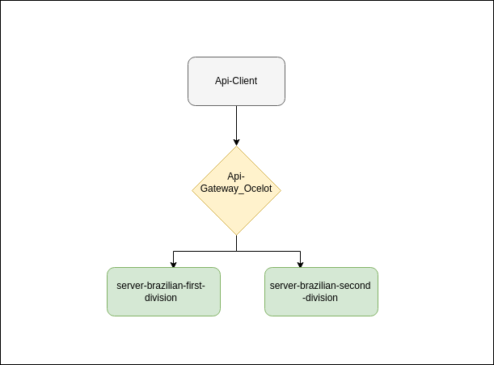

# Microservices using API Gateway
A simple example of the microservices using Api Gateway.

## Technologies used:
- .Net 7
- Ocelot

## Fluxogram: 

## Projects:
- https://github.com/rslewenstein/api-gateway-ocelot
- https://github.com/rslewenstein/server-brazilian-first-division
- https://github.com/rslewenstein/server-brazilian-second-division

## About Git Submodules:
It was used Git Submodules.

To create submodules:
- Create a new Github repository. 
- git submodule add <URL_NEW_REPOSITORY>

To Clone a project with submodules:
- git clone <URL_MAIN_PROJECT>
- git submodule init

You can see more about Git Submodules here:
- https://git-scm.com/book/en/v2/Git-Tools-Submodules

## API parameters:
- 1 - to get a list of first division teams.
- 2 - to get a list of second division teams.